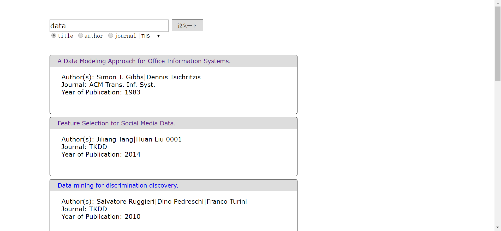
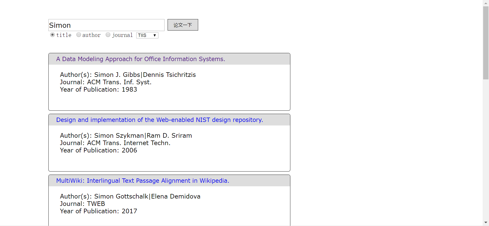
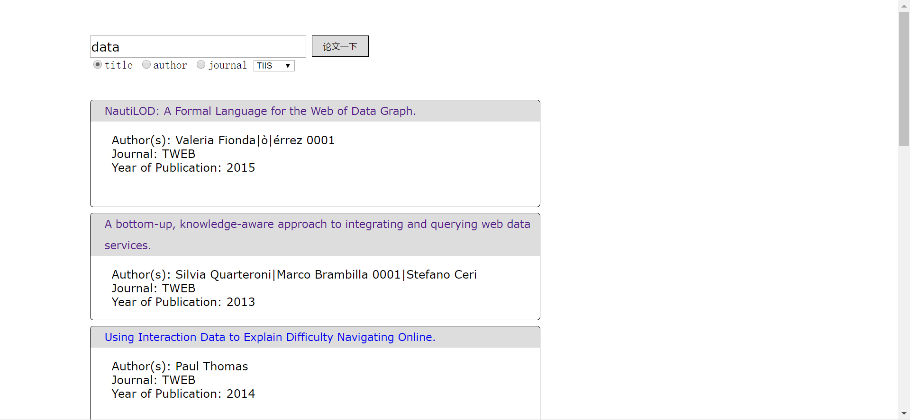

# local-dblp
> A local thesis searching website with Java
>
>
> Authors: Chuqian Zeng
>
>
> Time: June, 2018

## Requirement
* Java 1.8
* Java Servlet
* SQL database

## Usage
### Database implementation
* Import the mysql connector (see [mysql-connector](https://dev.mysql.com/downloads/connector/j/)) to your java library
* Import the [dblp.sql](./src/dblp.sql) into your local database
* Alter the "USER" and "PASSWORD" in [Connector.java](./src/connect_database/Connector.java) to the username and password of your own local database

### Servlet implementation
* Implement Servlet into the project (see [Java Servlet Technology](https://www.oracle.com/java/technologies/java-servlet-tec.html))

## Result Display
* Search with title of thesis: 

* Search with author of thesis: 

* Search with journal of thesis: 

